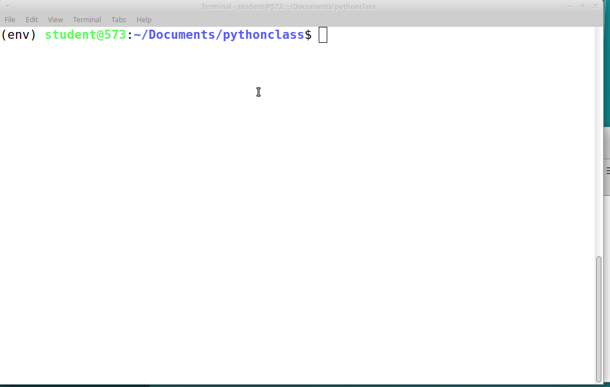
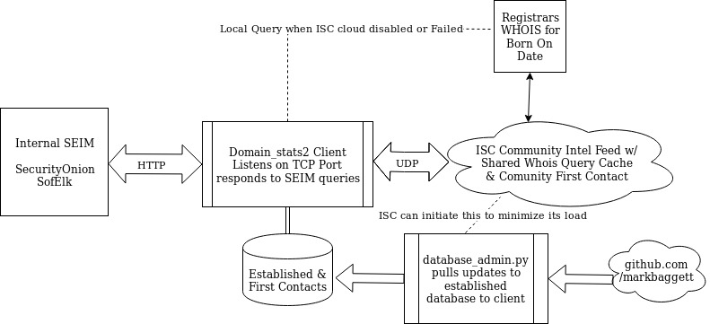

# domain_stats2

## Introduction
The SANS ISC (Internet Storm Center) is providing some funding and will pay for whois API access.   This improves the data quality and reliability but it completely changes the way I access the data.  This requires a significant rewrite.  This is in a transitional state right now as I move from the old to the new. **Note ISC Integration is disabled for the moment until it's release.

## The Old Domain_stats
This version of domains_stats provides a number of benefits over the old version includeing performance, scalability, alerting, and isc integration.  It does focus on born-on information which was the primary use of the tool and achieves its increaces performance by not processing the entire whois record.  If you are looking for a copy of the old domain_stats which rendered ALL of the whois record rather than just the born-on information please let me make two suggestions.  First, that functionality has been moved to a new tool called "APIify" which can render any standard linux command in a json response for consumption.  It also has improved caching and scalability over the old domain_stats.   You can download [APIify HERE](https://github.com/markbaggett/apiify).   You can also find the old version of domain_stats [in the releases section](https://github.com/MarkBaggett/domain_stats/releases/tag/1.0).

## TO INSTALL:

Install it as a Python package.  At a bash prompt run the following:
```
$ apt-get install python3-pip
$ python3 -m pip install pyyaml rdap domain_stats
```

If you have problems remember this is early code. You might choose to install it from github instead to get the latest fixes.
Note: pyyaml and rdap must be installed before running setup.

```
$ python3 -m pip install pyyaml rdap
$ git clone https://github.com/markbaggett/domain_stats
$ cd domain_stats
$ python3 setup.py install
```

Then make a directory that will be used to for storage of data and configuration files and run domain_stats.  Pass it the path to the directory you created.
```
$ mkdir data
$ cd data
$ domain_stats ./
```

domain_stats should setup the directory and start listening.



## SEIM Integration:
This varies depending upon the SEIM. The web interface is designed for your SEIM to make API calls to it.  It will respond back with a JSON responce for you it to consume.  Since many SEIM products are already configured to consume ZEEK logs another easy option is to add the ["domain_stats.zeek"](./domain_stats/utils/domain_stats.zeek) module to your zeek configuration. 


## Using domain_stats

This is a complete rewrite and new approach to managing baby domains in your organization.  Based on feedback from the community Domain_stats was really only used for baby domain information.  This new iteration focuses on that data and how to make it useful.  In this process it now tracks "FIRST CONTACT" so you know when your organization and/or the ISC has seen that domain before.

The domain stats client is focused on quickly giving you 5 pieces of data for every domain name you ask it for.  That is when the domain was first seen by you, when it was first seen by the security community and when it was first seen by the web.

SEEN_BY_YOU - Values: Date First Seen by you

SEEN_BY_ISC  - Values: NA or Date First seen by ISC  (NA indicates that it was resolved by the local database no ISC is required.)

SEEN_BY_WEB - Values: CreationDate

CATEGORY    - NEW or ESTABLISHED  (indicating whether it is less than 2 years old since the SEEN_BY_WEB date)

ALERT      -  List of alerts regarding this domain.   Including:
              YOUR-FIRST-CONTACT  - This request is first time you have ever seen this domain on your network
              ISC-FIRST-CONTACT  - This is the first time any domain_stats user has seen this domain on their network
              <other>  - The ISC may add other alert for a domain 


Here are some examples of how these are useful.
If your SIEM sees a request for google.com that is not a new domain and has been established for may years. Your response may look like this:

```
student@573:~/Documents/domain_stats2$ wget -q -O- http://127.0.0.1:8000/google.com
{"seen_by_web": "1998-10-08 07:30:02", "seen_by_isc": "NA", "seen_by_you": "2019-12-24 15:30:02", "category": "ESTABLISHED", "alerts": ['YOUR-FIRST-CONTACT']}
```
When the domain has been around for more than two years domain stats responds and tells you that is an "ESTABLISHED" domain.  Notice that ALERTS is set to "YOUR-FIRST-CONTACT". Since this is a brand new domain stats installation this is the first time my organization has ever queried google.  You will only see "YOUR-FIRST-CONTACT" once for each domain. Also "SEEN_BY_ISC" is set to NA indicating that this query was resolved locally by your domain client and it didn't need to talk to the ISC.  That means that this is a well known established domain that has been around for a long time and your local client has it in its database.  Generally speaking you can most likely ignore the NA SEEN_BY_ISC domains.
 
Lets look at another domain.  Look at markbaggett.com.

```
student@573:~/Documents/domain_stats2$ wget -q -O- http://127.0.0.1:8000/markbaggett.com
{"seen_by_web": "2015-12-12 19:34:59", "seen_by_isc": "2019-06-08 10:03:17", "seen_by_you":"2019-06-08 10:03:17", "category": "ESTABLISHED", "alerts": ['YOUR-FIRST-CONTACT'] 
```
The domain markbaggett.com wasn't in the local database on my server so it had to go off and ask the SANS Internet Storm Center server for that information. It got back a "seen_by_web" date of 12-12-2015.  This is the domains registration date. The category indicates that this is an "ESTABLISHED" domain.  It will added to the client database for all future queries unless any additional alerts were set by the ISC. Domains that have an alert associated with them will be cached for 24 hours. Then another query will be sent to the ISC.  This process is repeated until the isc alert for that domain is cleared.  Notice there is a date for "seen_by_isc".  That is the first time ANYONE using domain_stats queried the central server for that domain. Someone using domain stats ask about that domain that back on July 8th. That is a few months ago so it isn't brand new to the community. If no one using domain stats had ever asked about that domain there would have been an additional alert that says "ISC-FIRST-CONTACT". Last we can see it is again the YOUR-FIRST-CONTACT alert for our organization.   

A domain with a very recent "seen_by_web", "seen_by_isc" and "seen_by_you" date should be investigated. The vast majority of domains have been around for a few years before they are stable and gain popularity.  Domains used by attackers are usually established shortly before they are used. 

Anytime you see a "???-FIRST-CONTACT" on a domain that has been running for some period of time it is at the least a good thing to be aware of.  If it is the FIRST CONTACT for both you and the community then that is even more interesting. (Unless of course you are of the few beta testers where the community is very small and not much different that seen_by_you.)





The goal is to push as much of the "ESTABLISHED" data to the client local lan as possible. This minimizes network traffic keeps as much data as possible on the client network. When contacting the central server it will periodically inform the client to pull list of new domains and add them to the client established database.

The domain_stats.yaml file has many useful configurations includeing the "mode".  For now it is in "rdap" mode by default.  Which means instead of going to the ISC for domains it will do RDAP queries.  This is a useful stop gap measure but lacks the additional alerting providing by the ISC.

More data to come later as features and functions are more firmly established.

You can check the efficiency of your domain_stats server cache with the following request.

$ wget -q -O- http://127.0.0.1:8000/stats
Will show statistics on the efficiency of the memory cache and the database hit rate.

$ wget -q -O- http://127.0.0.1:8000/showcache
Will dump the cache

# Configuration

domain_stats behavior can be changed my modifying domain_stats.yaml that is in its setup directory.  In that file you will find the following useful items.

- You can adjust the maximum number of items domain stats will keep in memory cache with cached_max_items. Each record consumes 32 bytes so 65536 assumes you can spare about 2MB of memory for the cache. For performance reasons this number should be a power of 2.
```
cached_max_items: 65536
```
- You can specify the name of the database with database_file.
```
database_file: domain_stats.db
```
- What IP address do you want domain stats to listen on? 0.0.0.0 means all public and private IP addresses. You should change this to 127.0.0.1 if you run domain_stats on the same server that is doing the request to the API.
```
local_address: 0.0.0.0
```
- Set which TCP port do you want the server to listen on with local_port
```
local_port: 8000
```
- The name of the file where you want to store the memory cache on disk when the tool exists. Keep this in a SECURE location.
```
memory_cache: domain_stats.cache
```
- The prohibited_tlds is a section that lists top level domains that will not be sent to the central server for resolution. List each domain beneith the word "prohibited_tlds" (Yes i know they are not TLDS) with a **dash space** in front of them.
```
prohibited_tlds:
- yourdomainhere.local
```
- server_name is the hostname of the central domain stats server use to lookup host that are not in the database when in isc mode
```
server_name: domain_stats.isc.sans.edu
```
- This is the tcp port the central isc domain stats server
```
server_port: 4100
```
- Where to get new domain expiration data from when domain_stats_db_admin -u is run
```
target_updates: https://raw.githubusercontent.com/MarkBaggett/domain_stats/master/data
```
- ALL timestamps are UTC if you want "seen_my_you" to be in your local timezone make that adjustment here. Example EST=-5 EDT=-4, etc.  The server does not change this value automatically during daylight savings time.
```
timezone_offset: 0
```
- Control the amount of data logged with log_detail.  0=off, 1=on, 2=debug
```
log_detail: 0
```
- Mode can be isc or rdap. rdap is local resolution with no community data. isc has the good stuff.
```
mode: rdap
```


# ISC API Specification 
API requests look like this
```
{"command":  <command string>,  additional arguments depending upon command}
```
Valid COMMANDS include "CONFIG", "STATUS", and "QUERY"


### **CONFIG command requests configuration options the ISC would like to enforce on the client**
request:
```
{"command": "config"}
```
response:
```
{"min_software_version": "major.minor string",  "min_database_version", "major.minor string", prohitited_tlds:["string1","string2"]}
```
- clients will not query ISC for Domains listed in prohibited_tlds.   Examples may be ['.local', '.arpa']
- If min_software_version is higher than the client software version it causes the software to abort
- if min_database_version is higher than database version it forces the client to download new domains from github.com/markbaggett and add it to its local database


### **STATUS command allows the clients to tell the ISC how they are doing and see if they can continue.  This can be used to tune client efficiency and reduce ISC requests.**
Request:
```
{"command":"status", "client_version":client_version, "database_version":database_version, "cache_efficiency":[cache.hits, cache.miss, cache.expire], "database_efficiency":[database_stats.hits, database_stats.miss]}
```
Response:
```
{"interval": "integer number of minutes ISC wishes to wait until next status update", "deny_client": "client message string"}
```
- interval: The interval tells the client how many minutes to wait before sending another status updates
- deny_client: If set aborts the client with the specified message


### **QUERY command allows clients to query a domain record.**
Requests:
```
{"command": "query", "domain": "example.tld"}
```
RESPONSES (two possible):
##### A success response looks like this:

```
{"seen_by_web": '%Y-%m-%d %H:%M:%S', "expires": '%Y-%m-%d %H:%M:%S', "seen_by_isc":'%Y-%m-%d %H:%M:%S', "alerts":['list','of','alerts]}
```
   - seen_by_web is the domains creation date from the whois record. The time stamp must be in '%Y-%m-%d %H:%M:%S' format
   - expires is the date that the domains registration expires from the whois record. The timestamp must be in '%Y-%m-%d %H:%M:%S' format
   - seen_by_isc is the date that the first domain_stats client requested this domain from the isc. If this was the first request it will have the current date and time and 'ISC-FIRST-CONTACT' will be added to the alerts. The timestamp must be in '%Y-%m-%d %H:%M:%S' format.
   - Alerts must include "ISC-FIRST-CONTACT" if this is the first time anyone has ever queried ISC for this domain
   - Setting any additional alerts limits will cause the client record to not be commited to the database. Instead it is cached for 24 hours on the client.  After 24 hours the client will query the isc again.
##### An error response looks like this:

```
{"seen_by_web":"ERROR", "expires":"ERROR", "seen_by_isc":<integer specifying cache time to live>, "alerts":['alerts','for','that','domain']}
```
   - seen_by_web and expires must be set to "ERROR" when an error has occured.
   - Error time to live tell the client how long to cache and reuse the error for that domain.
   - Integer > 0 - will cache the error for that many hours
   - 0 - will not cache the error at all
   - -1 - will cache it such that it does not expire, but the domain can still drop out of cache based on LRU algorithm
   - -2 - PERMANENT cache entry.  Will never expire.  DANGEROUS. Use with caution.
    
